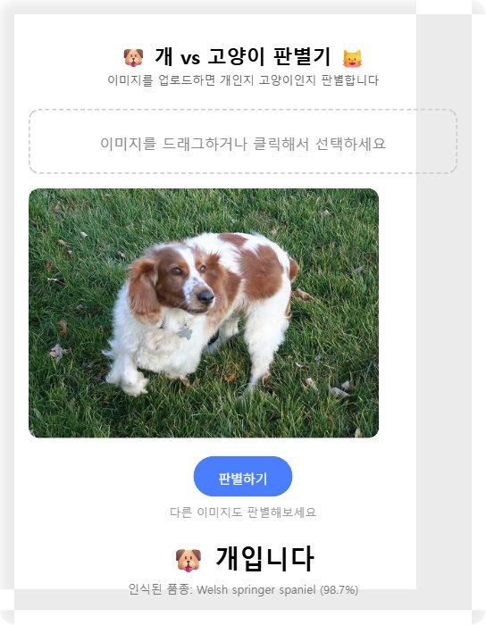

# 개 vs 고양이 판별기

업로드한 이미지가 개인지 고양이인지 브라우저에서 바로 판별하는 웹 앱입니다. 서버나 설치 과정 없이 `index.html`을 여는 것만으로 동작합니다.

## 스크린샷

## 사용법

`index.html` 파일을 더블클릭해서 브라우저로 열면 됩니다. (인터넷 연결 필요 — TensorFlow.js/MobileNet 모델을 CDN에서 불러옵니다.)

1. 이미지를 드래그하거나 클릭해서 업로드
2. "판별하기" 클릭
3. 개/고양이 판별 결과와 인식된 품종, 신뢰도가 표시됨

## 동작 방식

- [TensorFlow.js](https://www.tensorflow.org/js) + [MobileNet](https://github.com/tensorflow/tfjs-models/tree/master/mobilenet) 사전학습 모델을 사용합니다.
- MobileNet은 개/고양이를 직접 구분하는 모델이 아니라 ImageNet 1000개 클래스(품종 단위)를 분류하는 모델입니다. 예측된 품종명이 개 품종 목록/고양이 품종 목록 중 어디에 속하는지로 개/고양이를 판별합니다.
- 개/고양이가 아닌 사물이면 "판별 불가"로 표시됩니다.

## 제한 사항

별도의 학습 데이터 없이 사전학습 모델만 사용하므로, 흔하지 않은 품종이거나 사진이 흐릿하면 오판별하거나 "판별 불가"가 나올 수 있습니다.
